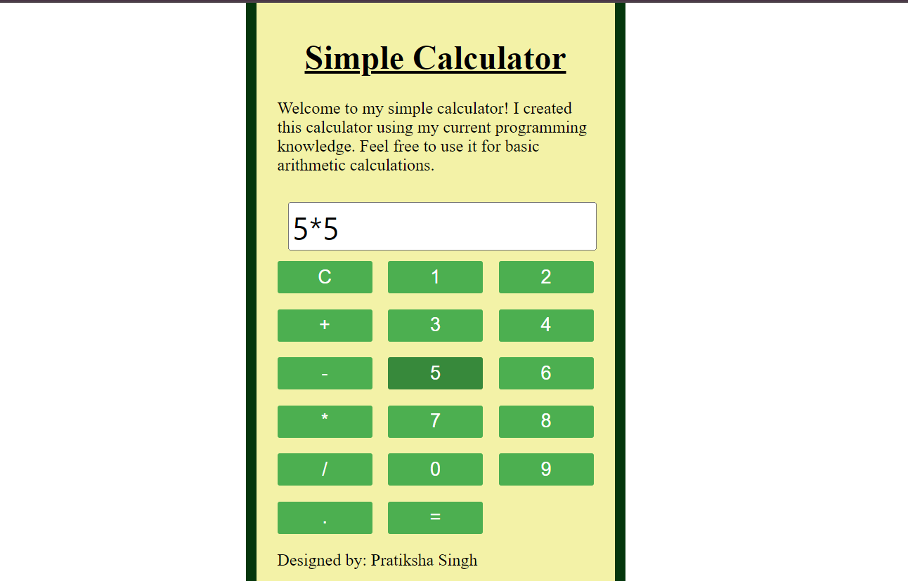

# Simple Calculator

A basic calculator implemented in JavaScript.

## Features

- Addition
- Subtraction
- Multiplication
- Division

## Use the buttons to perform calculations:

- Click on the numerical buttons to enter numbers.
- Use the operation buttons (+, -, *, /) to perform calculations.
- Press the "C" button to clear the input.

## Technologies Used

- HTML5
- CSS3
- JavaScript
